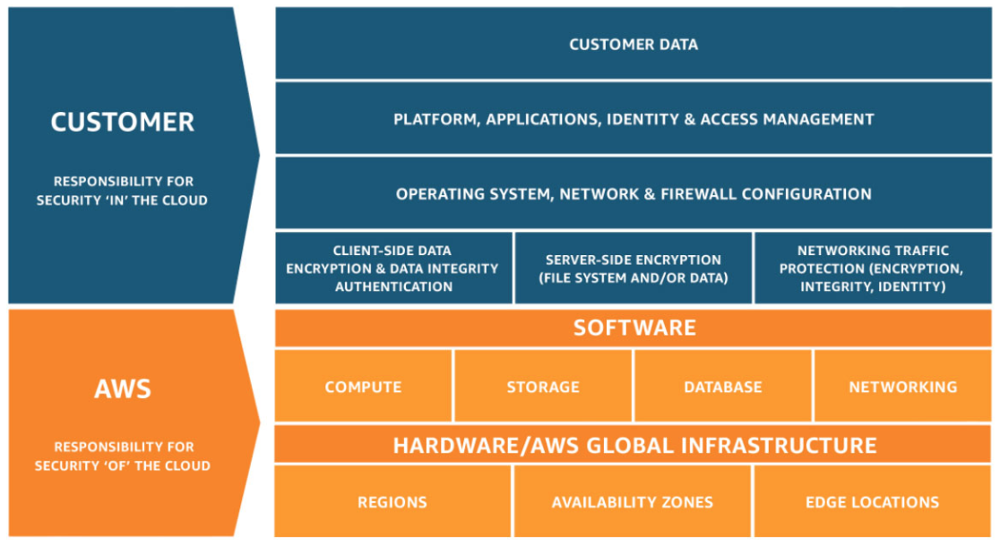

Important points

- ASG : Launch configurations are immutable meaning they cannot be updated. You have to create a new launch configuration, attach it to the ASG and then terminate old instances / launch new instances
- Instance Stores or EBS volumes are local disks and cannot be shared across instances.
- To allow access to your Amazon S3 bucket only from a CloudFront distribution, first add an origin access identity (OAI) to your distribution
- Dynamic port mapping with an Application Load Balancer makes it easier to run multiple tasks on the same Amazon ECS service on an Amazon ECS cluster.
- Minimum capacity to be highly available is 2 instances even when the ASG is deployed in 3 AZ
- Network Load Balancers expose a fixed IP to the public web, therefore allowing your application to be predictably reached using these IPs, while allowing you to scale your application behind the Network Load Balancer using an ASG. Application and Classic Load Balancers expose a fixed DNS (=URL)
- AWS Lambda functions time out after 15 minutes
- With SNI support we’re making it easy to use more than one certificate with the same ALB. The most common reason you might want to use multiple certificates is to handle different domains with the same load balancer. It’s always been possible to use wildcard and subject-alternate-name (SAN) certificates with ALB, but these come with limitations. Wildcard certificates only work for related subdomains that match a simple pattern and while SAN certificates can support many different domains, the same certificate authority has to authenticate each one. That means you have reauthenticate and reprovision your certificate everytime you add a new domain. (https://aws.amazon.com/blogs/aws/new-application-load-balancer-sni/)

- By default, CloudFront caches a response from Amazon S3 for 24 hours (Default TTL of 86,400 seconds). If your request lands at an edge location that served the Amazon S3 response within 24 hours, CloudFront uses the cached response even if you updated the content in Amazon S3.
Use one of the following ways to push the updated S3 content from CloudFront:
  - Invalidate the S3 objects.
  - Use object versioning.
- On your custom origin web server application, add Cache-Control no-cache, no-store, or private directives to the objects that you don't want CloudFront to cache. Or, add Expires directives to the objects that you don't want CloudFront to cache.
- You can create multiple hosted zone for the same domain name
- Amazon Route 53 is an authoritative DNS service and does not provide website hosting.
- Amazon Route 53 supports wildcard entries for all record types, except NS records
- To enable DNS Failover for an ELB endpoint, create an Alias record pointing to the ELB and set the “Evaluate Target Health” parameter to true

- Perfect Forward Secrecy is a feature that provides additional safeguards against the eavesdropping of encrypted data, through the use of a unique random session key. This prevents the decoding of captured data, even if the secret long-term key is compromised.
- CloudFront and Elastic Load Balancing are the two AWS services that support Perfect Forward Secrecy.

- Shared responsibility model

  - The shared responsibility model for infrastructure services, such as Amazon Elastic Compute Cloud (Amazon EC2) for example, specifies that AWS manages the security of the following assets:
    - Facilities
    - Physical security of hardware
    - Network infrastructure
    - Virtualization infrastructure
  - You as the customer are responsible for the security of the following assets:
    - Amazon Machine Images (AMIs)
    - Operating systems
    - Applications
    - Data in transit
    - Data at rest
    - Data stores
    - Credentials
    - Policies and configuration

- Amazon Simple Queue Service (SQS) and Amazon Simple Workflow Service (SWF) are the services that you can use for creating a decoupled architecture in AWS. Decoupled architecture is a type of computing architecture that enables computing components or layers to execute independently while still interfacing with each other.
- Amazon SQS offers reliable, highly-scalable hosted queues for storing messages while they travel between applications or microservices. Amazon SQS lets you move data between distributed application components and helps you decouple these components. Amazon SWF is a web service that makes it easy to coordinate work across distributed application components.

Serverless in AWS
- AWS Lambda & step functions
- DynamoDB
- AWS Cognito
- AWS API gateway
- Amazon S3
- AWS SNS & SQS
- AWS kinesis
- Aurora serverless

- Using Redis AUTH command can improve data security by requiring the user to enter a password before they are granted permission to execute Redis commands on a password-protected Redis server
- To require that users enter a password on a password-protected Redis server, include the parameter --auth-token with the correct password when you create your replication group or cluster and on all subsequent commands to the replication group or cluster.
- Remember subnet is AZ specific ( 1 subnet = 1 AZ )

- soft limit of 20 ec2 instances per region , need to submit limit increase form to AWS to increase limit
