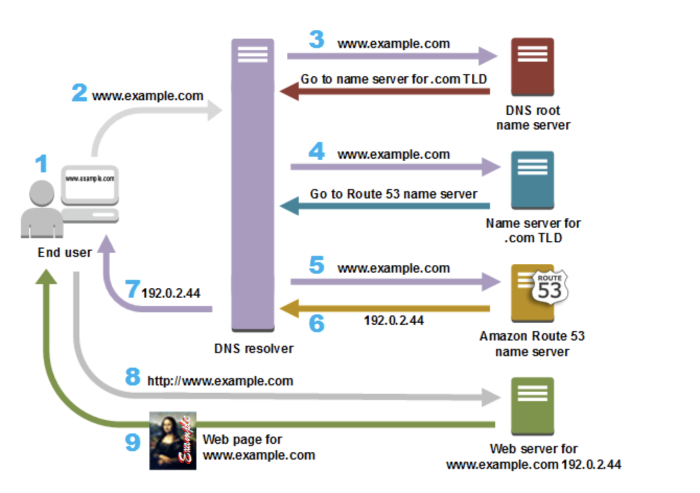

> #### [Route 53](https://docs.aws.amazon.com/route53)

Amazon Route 53 is a highly available and scalable Domain Name System (DNS) web service
- Register domain names
- Route internet traffic to the resources for your domain
- Check the health of your resources

- Route53 is a Managed DNS (Domain Name System)
  - DNS = Collection of rules and records to guide clients to reach a server through URLs.
  - 🤗 DNS is on port 53 that's where the name comes from.
- Route 53 can use both public and private domain names:
  - e.g. `application1.mypublicdomain.com`
  - e.g. `application1.company.internal` (can be resolved by your instances in your VPCs).
- Route 53 has advanced features:
  - **Load balancing** -> through DNS - also called client load balancing
  - **Health checks** -> although limited
  - **Routing policy** -> simple, failover, geolocation, latency, weighted, multi value
- **Hosted Zone**
  - Container that holds information about how you want to route traffic for a domain
    - E.g. `example.com` and its subdomains.
  - Can be public or private zone for public & private domain names.
    - Public hosted zone for public domain names
      - Accessible from www e.g. `application1.mypublicdomain.com`
    - Private domain names for private domain names
      - Gets resolved by instances in VPC e.g. `application1.company.internal`
      - 📝 ❗ If you use custom DNS domain names in a private zone in Route 53, you must set both attributes to true in VPC: `enableDnsSupport`, `enableDnsHostname`.
  - ❗ You need to delete all record sets in order to delete Hosted Zone

- **TTL (time to live)**
  - Computer caches DNS request for TTL duration
    - E.g. if `domainname.com` points to an IP, computer caches it.
  - Cache is only updated after TTL is expired, computer then talks to Route 53 again.
  - High TTL vs Low TTL
    - High TTL: e.g. 24 hours
      - Less traffic to DNS so it's cheaper
      - Possible change of out-dated DNS
    - Low TTL e.g. 60 seconds -> more traffic to DNS & easy to change records
- You can test DNS queries to see if it resolves right with `nslookup domainname.com` in Windows and `dig domainname.com` in Mac.

##### Key Features

- Resolver
- Traffic flow
- Latency based routing
- Geo DNS
- Private DNS for Amazon VPC
- DNS Failover
- Health Checks and Monitoring
- Domain Regisration
- CloudFront and S3 Zone Apex Support
- Amazon ELB Integration

#### AWS Route 53 , most common records

- A : URL to IPv4
- AAAA : URL to IPv6
- CNAME : URL to URL
- Alias : URL to AWS resource

##### Domain Registration

- Choose a domain name and confirm that it’s available, then register the domain name with Route 53. The service automatically makes itself the DNS service for the domain by doing the following:
  - Creates a hosted zone that has the same name as your domain.
  - Assigns a set of four name servers to the hosted zone. When someone uses a browser to access your website, such as www.example.com, these name servers tell the browser where to find your resources, such as a web server or an S3 bucket.
  - Gets the name servers from the hosted zone and adds them to the domain.
- If you already registered a domain name with another registrar, you can choose to transfer the domain registration to Route 53.

##### Routing Internet Traffic to your Website or Web Application

- Use the Route 53 console to register a domain name and configure Route 53 to route internet traffic to your website or web application.
- After you register your domain name, Route 53 automatically creates a public hosted zone that has the same name as the domain.
- To route traffic to your resources, you create records, also known as resource record sets, in your hosted zone.
- You can create special Route 53 records, called alias records, that route traffic to S3 buckets, CloudFront distributions, and other AWS resources.
- Each record includes information about how you want to route traffic for your domain, such as:
  - Name – name of the record corresponds with the domain name or subdomain name that you want Route 53 to route traffic for.
  - Type – determines the type of resource that you want traffic to be routed to.
  - Value

- Flow

##### Domain Registration Concepts

[R53 concepts](https://docs.aws.amazon.com/Route53/latest/DeveloperGuide/route-53-concepts.html)

- domain name - The name, such as example.com, that a user types in the address bar
- domain registrar - A company that is accredited by ICANN (Internet Corporation for Assigned Names and Numbers) to process domain registrations for specific top-level domains (TLDs). For example, Amazon Registrar, Inc. is a domain registrar for .com, .net, and .org domains.
- domain registry - A company that owns the right to sell domains that have a specific top-level domain. For example, VeriSign is the registry that owns the right to sell domains that have a .com TLD. A domain registry defines the rules for registering a domain, such as residency requirements for a geographic TLD. A domain registry also maintains the authoritative database for all of the domain names that have the same TLD. The registry's database contains information such as contact information and the name servers for each domain
- domain reseller - A company that sells domain names for registrars such as Amazon Registrar. Amazon Route 53 is a domain reseller for Amazon Registrar and for our registrar associate, Gandi.
- top-level domain (TLD) -
  - generic top-level domains
  - geographic top-level domains
- alias record
- authoritative name server
- DNS query
- DNS resolver
- Domain Name System (DNS)
- hosted zone :When you registered your domain, Amazon Route 53 automatically created a hosted zone with the same name. A hosted zone contains information about how you want Route 53 to route traffic for the domain.
- IP address
- name servers
- private DNS
- record (DNS record) : Each record contains information about how you want to route traffic
- routing policy
- subdomain
- time to live (TTL) - The length in secs that a DNS records is cached on either the resolving server or the users own PC

- **How does DNS work?**
  1. ***Query NS***: *Browser* makes DNS request to *Route 53 (DNS Server)* with e.g. `http://myapp.mydomain.com`
      - Top Level Domain Server then returns NS record to the name server.
  2. ***Query DNS***: *Browser* then queries NS server and gets SOA (start of authority) record where all DNS records exists
      - *Route 53 (DNS Server)* sends back IP e.g. `32.45.67.85` (= a record: URL to IP)
  3. ***Request content***: *Browser* makes HTTP Request to *application server* with e.g. `IP: 32.45.67.85` and with header `Host : http://myapp.mydomain.com`.
  4. ***Get content***: *Application server* returns with HTTP response
- **CNAME vs Alias**
  - AWS resources (load balancer, CloudFront, etc..) expose an AWS URL e.g. `lb1-1234.us-east-2.elb.amazonaws.com` and you want it to be `myapp.mydomain.com`
  - Two options
      1. CNAME
          - Points a URL to any other URL (app.mydomain.com => blabla.anything.com)
          - ❗ Only for non root domain (aka something.mydomain.com)
      2. Alias (AWS concept)
          - Points a URL to an AWS resource (app.mydomain.com => blabla.amazonaws.com)
          - 💡 Works for root domain and non root domain (e.g. mydomain.com)
          - Free of charge
          - Native health check
          - Good for pointing to e.g. load balancer / EC2 that'll have IP changing all the time.

##### Hosted Zones
- A hosted zone is a container for records, and records contain information about how you want to route traffic for a specific domain, such as example.com, and its subdomains (acme.example.com, zenith.example.com). A hosted zone and the corresponding domain have the same name. There are two types of hosted zones:

- **Public hosted zone** – route internet traffic to your resources
- **Private hosted zone** – route traffic within an Amazon VPC. You create a private hosted zone, and specify the VPCs that you want to associate with the hosted zone.
  - To use private hosted zones, you must set the following VPC settings to true:
    - enableDnsHostnames
    - enableDnsSupport
  - In a private hosted zone, you can associate Route 53 health checks only with weighted and failover records.
  - You can use the following routing policies when you create records in a private hosted zone:
    - Simple
    - Failover
    - Multivalue answer
    - Weighted
- When you register a domain with Route 53, it create a hosted zone automatically.
- When you transfer DNS service for an existing domain to Route 53, you start by creating a hosted zone for the domain.
- Route 53 automatically creates the Name Server (NS) and Start of Authority (SOA) records for the hosted zones.
- Route 53 creates a set of 4 unique name servers (a delegation set) within each hosted zone.
- Create records in the hosted zone
  - Records define where to route traffic for each domain name or subdomain name.
  - name of each record in a hosted zone must end with the name of the hosted zone.

##### Route 53 Split-view (Split-horizon) DNS
- Route 53 Split-view (Split-horizon) DNS enables you to access an internal version of your website using the same domain name that is used publicly
- You can maintain both a private and public hosted zone with the same domain name for split-view DNS with Route 53
- Ensure that DNS resolution and DNS hostnames are enabled on the source VPC.
- DNS queries will respond with answers based on the source of the request. From within the VPC, answers will come from the private hosted zone, while public queries will return answers from the public hosted zone.

##### Records

- Create records in a hosted zone. Records define where you want to route traffic for each domain name or subdomain name. The name of each record in a hosted zone must end with the name of the hosted zone.
- Alias Records
  - Route 53 alias records provide a Route 53–specific extension to DNS functionality. Alias records let you route traffic to selected AWS resources. They also let you route traffic from one record in a hosted zone to another record.
  - Alias records are not standard for DNS RFC and are a Route 53 extension to DNS functionality
  - Alias record is similar to a CNAME record, but can create an alias record both for the root domain or apex zone, such as example.com, and for subdomains, such as www.example.com. CNAME records can be used only for subdomains.
  - Route 53 automatically recognizes changes in the resource record sets that the alias resource record set refers to for e.g. for a site pointing to an load balancer, if the ip of the load balancer changes, Route 53 will reflect those changes automatically in the DNS answers without any changes to the hosted zone that contains resource record sets
  - If an alias resource record set points to a CloudFront distribution, a load balancer, or an S3 bucket, the time to live (TTL) can’t be set; Route 53 uses the CloudFront, load balancer, or Amazon S3 TTLs.
  - You can create an alias record at the top node of a DNS namespace, also known as the zone apex.
- CNAME Record
  - You cannot create an alias record at the top node of a DNS namespace using a CNAME record.
  - DNS protocol does not allow creation of a CNAME record for the top node of a DNS namespace, also known as the zone apex for e.g. the DNS name example.com registration, the zone apex is example.com, a CNAME record for example.com cannot be created, but CNAME records can be created for www.example.com, newproduct.example.com etc.
  - If a CNAME record is created for a subdomain, any other resource record sets for that subdomain cannot be created for e.g. if a CNAME created for www.example.com, not other resource record sets for which the value of the Name field is www.example.com can be created
- Alias records vs CNAME records

|CNAME Records|Alias Records|
|-------------|-------------|
|You can’t create a CNAME record at the zone apex.|You can create an alias record at the zone apex. Alias records must have the same type as the record you’re routing traffic to.|
|Route 53 charges for CNAME queries.|Route 53 doesn’t charge for alias queries to AWS resources.|
|A CNAME record redirects queries for a domain name regardless of record type.|Route 53 responds to a DNS query only when the name and type of the alias record matches the name and type in the query.|
|A CNAME record can point to any DNS record that is hosted anywhere.|An alias record can only point to selected AWS resources or to another record in the hosted zone that you’re creating the alias record in.|
|A CNAME record appears as a CNAME record in response to dig or Name Server (NS) lookup queries.|An alias record appears as the record type that you specified when you created the record, such as A or AAAA.|

##### Supported DNS Record Types
- **A Record Type** – the most fundamental type of DNS record and the "A" in the A record stands for address.The A records is used by computer to translate the name of the domain to the IP address
- **AAAA Record Type** – the value for a AAAA record is an IPv6 address in colon-separated hexadecimal format.
- **CAA Record Type** – lets you specify which certificate authorities (CAs) are allowed to issue certificates for a domain or subdomain.
- **CNAME Record Type** – A canonical name(CNAME) can be used to resolve one domain name to another.For eg. you may have a mobile website with the domain name http://m.mysite.com and you may also want the name htpp://mobile.mysite.com to resolve to the same address
- **MX Record Type** – each value for an MX record actually contains two values, priority and domain name.
NAPTR Record Type
- **NS Record Type** – stands for Name server records and are used by top level domain servers to direct traffic to the content DNS server which contains the authoritative DNS records
- **PTR Record Type** – is the same format as a domain name.
- **SOA Record Type** – provides information about a domain and the corresponding Amazon Route 53 hosted zone.
  - name of the server that supplied the data for the zone
  - the administrator of the zone
  - current version of the data file
  - number of secs the secondary server should wait before cheching for update
  - number of secs the secondary server should wait before retrying a failed zone transfer
  - maximum secs that a secondary server can use data before it must either be refreshed or expire
  - default number of secs for the TTL file on the resource records

- **SPF Record Type**
- **SRV Record Type**
- **TXT Record Type**

##### Routing Policies

- Associated in a DNS record set.

  | Policy | Description | Use cases | Creation | Notes |
  | ------ | ----------- | --------- | -------- | ----- |
  | **Simple routing policy** | One domain to one/more IP/URL | Single instance | One set to target(s) | ❗ You can't attach health checks to simple routing policy • Multiple IP handling is not standard, most clients do round robin • Route 53 retuns in random order |
  | **Weighted routing policy** | Control % of request to which targets | AB testing, split traffic between regions | Record set per endpoint with single weight | Only selected address is calculated returned to the client by Route 53 |
  | **Latency routing policy** | Redirect to least latency target | Low latency requirement | Record set per endpoint & region to the same DNS name. | Not based on region e.g. Germany may be directed to the US (if that's the lowest latency) |
  | **Failover routing policy** | To healthy target(s) | Active-passive failover | 2 record sets, one primary and one secondary for same target | • Secondary is activated when primary fails • Primary must have health check, optional for secondary |
  | **Geolocation routing policy** | Based on user location | E.g. traffic from UK goes to IP X | Record set per location (country, region or default) | 💡 Should create "default" policy if there's no match |
  | **Geoproximity routing policy** | Based on user and resource location | Shift traffic from resources in one location to resources in another | For each rule, if AWS resource set value as AWS region else latitude and longitude of resource | • You must use Route 53 traffic flow • Uses configurable biases to route more or less • Bias expands or shrinks zone from where traffic is routed to a resource |
  | **Multi Value routing policy** | Improves *simple routing policy* with health checks | • Traffic to multiple resources • Must have health checks | Record set for each target | • Enables client side load balancing • up to eight healthy records selected at random|

##### DNS Domain Name Format

- Names of domains, hosted zones, and records consist of a series of labels separated by dots, which can be up to 63 bytes long. The total length of a domain name cannot exceed 255 bytes, including the dots.
- You can create hosted zones and records that include * in the name.

##### Using Traffic Flow to Route DNS Traffic

- You use the visual editor to create a traffic policy. A traffic policy includes information about the routing configuration that you want to create:
  - the routing policies that you want to use
  - resources that you want to route DNS traffic to, such as the IP address of each EC2 instance and the domain name of each ELB load balancer.
- Create a policy record where you specify the hosted zone in which you want to create the configuration that you defined in your traffic policy. It’s also where you specify the DNS name that you want to associate the configuration with.

##### Route 53 Resolvers

- Resolver answers DNS queries for VPC domain names such as domain names for EC2 instances or ELB load balancers, and performs recursive lookups against public name servers for all other domain names.
- DNS resolvers on your network can forward DNS queries to Resolver in a specified VPC. You can also configure Resolver to forward queries that it receives from EC2 instances in your VPCs to DNS resolvers on your network.
- Resolver is regional.
- An inbound endpoint specifies the VPC that queries pass through on the way from your network to Resolver.
- To forward DNS queries that originate on EC2 instances in one or more VPCs to your network, you create an outbound endpoint and one or more rules.

##### Route 53 Health Checks

- Create a health check and specify values that define how you want the health check to work, such as:
  - The IP address or domain name of the endpoint that you want Route 53 to monitor.
  - The protocol that you want Route 53 to use to perform the check: HTTP, HTTPS, or TCP.
  - The request interval you want Route 53 to send a request to the endpoint.
  - How many consecutive times the endpoint must fail to respond to requests before Route 53 considers it unhealthy. This is the failure threshold.
- You can configure a health check to check the health of one or more other health checks.
- You can configure a health check to check the status of a CloudWatch alarm so that you can be notified on the basis of a broad range of criteria.

##### Route 53 Health Checks and DNS Failover

- Each health check that you create can monitor one of the following:
  - The health of a specified resource, such as a web server
  - The status of other health checks
  - The status of an Amazon CloudWatch alarm

- Each health checker evaluates the health of the endpoint based on two values:
  - Response time
  - Whether the endpoint responds to a number of consecutive health checks that you specify (the failure threshold)
- Types of health checks
  - HTTP and HTTPS health checks – Route 53 must be able to establish a TCP connection with the endpoint within four seconds. In addition, the endpoint must respond with an HTTP status code of 2xx or 3xx within two seconds after connecting.
  - TCP health checks – Route 53 must be able to establish a TCP connection with the endpoint within ten seconds.
  - HTTP and HTTPS health checks with string matching – Route 53 must be able to establish a TCP connection with the endpoint within four seconds, and the endpoint must respond with an HTTP status code of 2xx or 3xx within two seconds after connecting. After a Route 53 health checker receives the HTTP status code, it must receive the response body from the endpoint within the next two seconds.
- Health-checking features to route traffic only to the healthy resources:
  - Check the health of EC2 instances and other resources (non-alias records)
  - Evaluate the health of an AWS resource (alias records)
- Two types of failover configurations
  - **Active-Active Failover**– all the records that have the same name, the same type, and the same routing policy are active unless Route 53 considers them unhealthy. Use this failover configuration when you want all of your resources to be available the majority of the time.
  - **Active-Passive Failover** – use this failover configuration when you want a primary resource or group of resources to be available the majority of the time and you want a secondary resource or group of resources to be on standby in case all the primary resources become unavailable. When responding to queries, Route 53 includes only the healthy primary resources.
- To create an active-passive failover configuration with one primary record and one secondary record, you just create the records and specify Failover for the routing policy.
- To configure active-passive failover with multiple resources for the primary or secondary record, create records with the same name, type, and routing policy for your primary resources. If you’re using AWS resources that you can create alias records for, specify Yes for Evaluate Target Health.
- You can also use weighted records for active-passive failover, with caveats.
- You can configure Amazon Route 53 to log information about the queries that Route 53 receives. Query logging is available only for public hosted zones.

##### Authentication and Access Control

- Authenticate with IAM before allowing to perform any operation on Route 53 resources.
- Every AWS resource is owned by an AWS account, and permissions to create or access a resource are governed by permissions policies. A permissions policy specifies who has access to what.

##### Monitoring

- The Route 53 dashboard provides detailed information about the status of your domain registrations, including:
  - Status of new domain registrations
  - Status of domain transfers to Route 53
  - List of domains that are approaching the expiration date
- You can monitor your resources by creating Route 53 health checks, which use CloudWatch to collect and process raw data into readable, near real-time metrics.
- Log API calls with CloudTrail

##### Pricing

- A hosted zone is charged at the time it’s created and on the first day of each subsequent month. To allow testing, a hosted zone that is deleted within 12 hours of creation is not charged, however, any queries on that hosted zone will still incur charges.
- Billion queries / month
- Queries to Alias records are provided at no additional cost to current Route 53 customers when the records are mapped to the following AWS resource types:
  - Elastic Load Balancers
  - Amazon CloudFront distributions
  - AWS Elastic Beanstalk environments
  - Amazon S3 buckets that are configured as website endpoints
- Traffic flow policy record / month
- Pricing for domain names varies by Top Level Domain (TLD)

##### 3rd Party Domains
- **Domain names**
  - Top level: last part e.g. `.gov`
    - IANA [has a database](http://iana.org/domains/root/db) of all available top-level domains
  - Second level *(optional)*: e.g. if it's `.gov.uk` then `.gov` is second level `.uk` is top level domain name.
- Domain name **registrar** is an organization that manages the reservation of Internet domain names under one or more domain names.
  - E.g. GoDaddy, Google Domains, Gandi...
    - You can also buy from AWS with Route 53.
      - It can take up to 3 days for registration to be completed.
  - Registers domains with InterNIC, a service of ICANN which enforces uniqueness of domain names across the internet.
  - Each domain name becomes registered in a central database known as the WhoIS database.
- You can also use 3rd party registrar with Route 53.
    1. Create a public Hosted Zone in Route 53
    2. Update NS records on 3rd party website to use Route 53 ***name servers*** (NS Records).
       - You get NS (name server) records from Hosted Zone & Route 53 that you copy & paste to you registrar.
- ❗ Soft limit of up to 50 domains managed by Route 53.

[Limits](https://docs.aws.amazon.com/Route53/latest/DeveloperGuide/DNSLimitations.html)

|Entity|Limit|
|------|-----|
|Domains|50 per AWS account|
|Hosted zones|500 per AWS account|
|Amazon VPCs that you can associate with a private hosted zone|100|
|Records|10,000 per hosted zone|
|Values in a record|400 per record|
|Health checks|200 active health checks per AWS account|

##### Other imp points

- ELB's do not have pre-defined IPv4 addresses, you resolve them using a DNS name
- Given the choice ,always choose an Alias record over a CNAME
- CNAME record is charged but Alias record is not   
