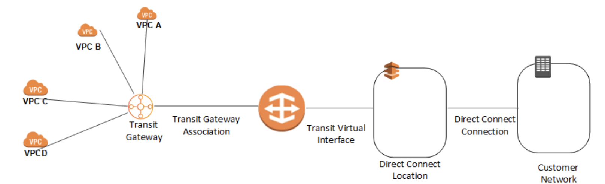

> #### [AWS Direct Connect]()
AWS Direct Connect links your internal network to an AWS Direct Connect location over a standard 1 gigabit or 10 gigabit Ethernet fiber-optic cable. One end of the cable is connected to your router, the other to an AWS Direct Connect router. With this connection in place, you can create virtual interfaces directly to the AWS cloud and Amazon Virtual Private Cloud, bypassing Internet service providers in your network path.

Beneficial Use Cases

- When transferring large data sets.
- When developing and using applications that use real-time data feeds.
- When building hybrid environments that satisfy regulatory requirements requiring the use of private connectivity.

AWS Direct Connect Components

- Connections
  - Create a connection in an AWS Direct Connect location to establish a network connection from your premises to an AWS Region.
- Virtual interfaces
  - Create a virtual interface to enable access to AWS services
  - public virtual interface
    - A public virtual interface enables access to public services, such as Amazon S3
  - private virtual interface
    - A private virtual interface enables access to your VPC
- AWS Direct Connect supports both the IPv4 and IPv6

Accessing a Remote AWS Region
- AWS Direct Connect locations in public Regions or AWS GovCloud (US) can access public services in any other public Region (excluding China (Beijing and Ningxia))
- In addition, AWS Direct Connect connections in public Regions or AWS GovCloud (US) can be configured to access a VPC in your account in any other public Region
- You can therefore use a single AWS Direct Connect connection to build multi-Region services. All networking traffic remains on the AWS global network backbone, regardless of whether you access public AWS services or a VPC in another Region.
- Any data transfer out of a remote Region is billed at the remote Region data transfer rate.
- Accessing Public Services in a Remote Region
  - To access public resources in a remote Region, you must set up a public virtual interface and establish a Border Gateway Protocol (BGP) session
- Accessing VPCs in a Remote Region
  - You can create a Direct Connect gateway in any public Region. Use it to connect your AWS Direct Connect connection over a private virtual interface to VPCs in your account that are located in different Regions or to a transit gateway
  - Alternatively, you can create a public virtual interface for your AWS Direct Connect connection and then establish a VPN connection to your VPC in the remote Region

AWS Direct Connect Connections Types

  | Model | Capacity | Method |
  | --- | --- | --- |
  | Dedicated connection | 1Gbps, 10 Gbps |  Connect directly to an AWS device from your router at an AWS Direct Connect location or work with an AWS Direct Connect Partner or a network provider to connect a router from your data center, office, or colocation environment to an AWS Direct Connect location\. The network provider does not have to be an [AWS Direct Connect Partner](https://aws.amazon.com/directconnect/partners) to connect you to a dedicated connection\. AWS Direct Connect dedicated connections support these port speeds over single\-mode fiber: 1 Gbps: 1000BASE\-LX \(1310nm\) and 10 Gbps: 10GBASE\-LR \(1310nm\)  |
  | Hosted connection | 50Mbps, 100Mbps, 200Mbps, 300Mbps, 400Mbps, 500Mbps, 1Gbps, 2Gbps, 5Gbps, and 10Gbps |  Work with a partner in the [AWS Direct Connect Partner Program](https://aws.amazon.com/directconnect/partners) to connect a router from your data center, office, or colocation environment to an AWS Direct Connect location\. Only certain partners provide higher capacity connections\.   |

Cross Connect

- After you have downloaded your Letter of Authorization and Connecting Facility Assignment (LOA-CFA), you must complete your cross-network connection, also known as a cross connect.
- If you already have equipment located in a Direct Connect location, contact the appropriate provider to complete the cross connect.
- If you do not already have equipment located in a Direct Connect location, you can work with one of the partners in the AWS Partner Network to help you to connect to an AWS Direct Connect location.

Virtual Interfaces
- You must create one of the following virtual interfaces to begin using your AWS Direct Connect connection :
 - Private virtual interface
    - A private virtual interface should be used to access an Amazon VPC using private IP addresses.
 - Public virtual interface
    - A public virtual interface can access all AWS public services using public IP addresses.
 - Transit virtual interface
    - A transit virtual interface should be used to access one or more transit gateways associated with Direct Connect gateways.
- A connection of less than 1 Gbps supports only one virtual interface.
- To create a virtual interface, you need the following information:
  - Connection
    - The AWS Direct Connect connection or link aggregation group (LAG) for which you are creating the virtual interface.
  - Virtual interface name
    - A name for the virtual interface.
  - Virtual interface owner
    -  If you're creating the virtual interface for another account, you need the AWS account ID of the other account.
  - Connection to(Private virtual interface only)
    - For connecting to a VPC in the same region, you need the virtual private gateway for your VPC.
  - VLAN
    - A unique virtual local area network (VLAN) tag that's not already in use on your connection.
  - Address family
    - Whether the BGP peering session will be over IPv4 or IPv6.
  - Peer IP addresses
    - A virtual interface can support a BGP peering session for IPv4, IPv6, or one of each (dual-stack). You cannot create multiple BGP sessions for the same IP addressing family on the same virtual interface. The IP address ranges are assigned to each end of the virtual interface for the BGP peering session.
  - BGP information
    - A public or private Border Gateway Protocol (BGP) Autonomous System Number (ASN) for your side of the BGP session. If you are using a public ASN, you must own it. If you are using a private ASN, it must be in the 64512 to 65535 range. Autonomous System (AS) prepending does not work if you use a private ASN for a public virtual interface.
    - An MD5 BGP authentication key. You can provide your own, or you can let Amazon generate one for you.
  - Prefixes you want to advertise(Public virtual interface only)
    -  Public IPv4 routes or IPv6 routes to advertise over BGP. You must advertise at least one prefix using BGP, up to a maximum of 1,000 prefixes.
  - Jumbo frames
    - The maximum transmission unit (MTU) of packets over AWS Direct Connect. The default is 1500

Link Aggregation Groups (LAG)
- A link aggregation group (LAG) is a logical interface that uses the Link Aggregation Control Protocol (LACP) to aggregate multiple connections at a single AWS Direct Connect endpoint, allowing you to treat them as a single, managed connection.
- You can create a LAG from existing connections, or you can provision new connections. After you've created the LAG, you can associate existing connections with LAG
- The following rules apply:
  - All connections in the LAG must use the same bandwidth.
  - You can have a maximum of four connections in a LAG. Each connection in the LAG counts towards your overall connection limit for the Region.
  - All connections in the LAG must terminate at the same AWS Direct Connect endpoint.
- All LAGs have an attribute that determines the minimum number of connections in the LAG that must be operational for the LAG itself to be operational. By default, new LAGs have this attribute set to 0. You can update your LAG to specify a different value—doing so means that your entire LAG becomes non-operational if the number of operational connections falls below this threshold. This attribute can be used to prevent over-utilization of the remaining connections.
- All connections in a LAG operate in Active/Active mode.

Direct Connect Gateways
- Use AWS Direct Connect gateway to connect your VPCs. You associate an AWS Direct Connect gateway with either of the following gateways:
  - A transit gateway when you have multiple VPCs in the same Region
  - A virtual private gateway
- A Direct Connect gateway is a globally available resource
- You can create the Direct Connect gateway in any public Region and access it from all other public Regions.
- Virtual Private Gateway Associations
  - You can use an AWS Direct Connect gateway to connect your AWS Direct Connect connection over a private virtual interface to one or more VPCs in your account that are located in the same or different Regions. You associate a Direct Connect gateway with the virtual private gateway for the VPC. Then, you create a private virtual interface for your AWS Direct Connect connection to the Direct Connect gateway. You can attach multiple private virtual interfaces to your Direct Connect gateway.
  - Associating a Virtual Private Gateway Across Accounts
    - You can associate a Direct Connect gateway with a virtual private gateway that's in a different AWS account.
    - The owner of the virtual private gateway creates an association proposal and the owner of the Direct Connect gateway must accept the association proposal.
    - You can only associate a Direct Connect gateway and virtual private gateway when the account that owns the Direct Connect gateway and the account that owns the virtual private gateway have the same payer ID.
- Transit Gateway Associations
  - You can use an AWS Direct Connect gateway to connect your AWS Direct Connect connection over a transit virtual interface to the VPCs or VPNs that are attached to your transit gateway. You associate a Direct Connect gateway with the transit gateway. Then, create a transit virtual interface for your AWS Direct Connect connection to the Direct Connect gateway.
  - This configuration offers the following benefits. You can:
    - Manage a single connection for multiple VPCs or VPNs that are in the same Region.
    - Advertise prefixes from on-premises to AWS and from AWS to on-premises.
  - The solution involves the following components:
    - A transit gateway that has VPC attachments.
    - A Direct Connect gateway.
    - An association between the Direct Connect gateway and the transit gateway.
    - A transit virtual interface that is attached to the Direct Connect gateway.

Virtual Private Gateway Association

Transit Private Gateway Association

Monitoring
- You can optionally assign tags to your Direct Connect resources to categorize or manage them. A tag consists of a key and an optional value, both of which you define.
- CloudTrail captures all API calls for AWS Direct Connect as events.
- Set up CloudWatch alarms to monitor metrics.

Pricing
- You pay only for the network ports you use and the data you transfer over the connection.
- Pricing is per port-hour consumed for each port type. Data transfer out over AWS Direct Connect is charged per GB. Data transfer IN is $0.00 per GB in all locations.

Limits

| Component | Limit | Comments |
| --- | --- | --- |
|  Virtual interfaces per AWS Direct Connect connection  |  50  |  This limit cannot be increased  |
| Transit virtual interfaces per AWS Direct Connect dedicated connection1 |  1  | This limit cannot be increased |
|  Active AWS Direct Connect connections per Region per account  | 10 |  |
|  Routes per Border Gateway Protocol \(BGP\) session on a private virtual interface  |  100  |  This limit cannot be increased  |
|  Routes per Border Gateway Protocol \(BGP\) session on a public virtual interface  |  1,000  |  This limit cannot be increased  |
|  Connections per link aggregation group \(LAG\)  | 4 |  |
|  Link aggregation groups \(LAGs\) per Region  |  10  |  |
|  AWS Direct Connect gateways per account  |  200  |  |
|  Virtual private gateways per AWS Direct Connect gateway  |  10  |  This limit cannot be increased  |
| Transit gateways per AWS Direct Connect gateway | 3 | This limit cannot be increased |
|  Virtual interfaces per AWS Direct Connect gateway  |  30  |  |
|  Transit gateways per AWS Direct Connect gateway  | 3 | This limit cannot be increased |
| Number of prefixes from on\-premise to AWS on a transit virtual interface | 100 | This limit cannot be increased |
| Number of prefixes from AWS to on\-premise on a transit virtual interface | 20 | This limit cannot be increased |
