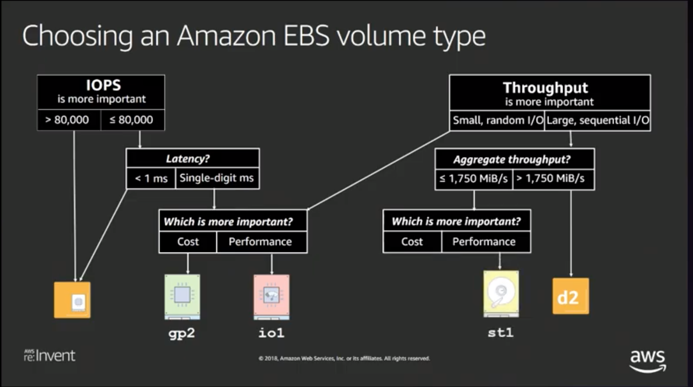

> #### [Amazon Elastic Block Store (Amazon EBS)](https://docs.aws.amazon.com/AWSEC2/latest/UserGuide/AmazonEBS.html?id=docs_gateway)

Features
- provides block level storage volumes for use with EC2 instances
- EBS volumes that are attached to an EC2 instance are exposed as storage volumes that persist independently from the life of the instance.
- recommended when data must be quickly accessible and requires long-term persistence
- particularly well-suited for use as the primary storage for file systems, databases, or for any applications that require fine granular updates and access to raw, unformatted, block-level storage.
- well suited to both database-style applications that rely on random reads and writes, and to throughput-intensive applications that perform long, continuous reads and writes.
- can launch your EBS volumes as encrypted volumes.

Benefits of Using EBS Volumes
- Data availability
  - create an EBS volume in an Availability Zone, it is automatically replicated within that zone
  - An EBS volume can be attached to only one instance at a time, but multiple volumes can be attached to a single instance
  - An EBS volume and the instance to which it attaches must be in the same Availability Zone.
  - monitoring data for your EBS volumes ,at no additional cost
- Data persistence
  - An EBS volume is off-instance storage that can persist independently from the life of an instance.
  - can automatically detach from the instance with their data intact when the instance is terminated if you uncheck the Delete on Termination
  - I the checkbox for Delete on Termination is checked, the volume(s) will delete upon termination of the EC2 instance
  - By default, the root EBS volume that is created and attached to an instance at launch is deleted when that instance is terminated. You can modify this behavior by changing the value of the flag DeleteOnTermination to false when you launch the instance
- Data encryption
  - you can create encrypted EBS volumes with the Amazon EBS encryption feature.
  - All EBS volume types support encryption
  - data-at-rest encryption
  - uses 256-bit Advanced Encryption Standard algorithms (AES-256) and an Amazon-managed key infrastructure
  - Uses AWS Key Management Service (AWS KMS) master keys when creating encrypted volumes and any snapshots created from your encrypted volumes
- Snapshots
  - ability to create snapshots (backups) of any EBS volume and write a copy of the data in the volume to Amazon S3, where it is stored redundantly in multiple Availability Zones
  - volume does not need to be attached to a running instance in order to take a snapshot
  -  can periodically create a snapshot of the volume to use as a baseline for new volumes
- Flexibility
  - support live configuration changes while in production. You can modify volume type, volume size, and IOPS capacity without service interruptions.

Amazon EBS Volume Types
- General Purpose SSD (gp2)
- Provisioned IOPS SSD (io1)
- Throughput Optimized HDD (st1)
- Cold HDD (sc1)
- Magnetic (standard, a previous-generation type)

Volumes categories
  - SSD-backed volumes
    - optimized for transactional workloads involving frequent read/write operations with small I/O size, where the dominant performance attribute is IOPS
  - HDD-backed volumes
    - optimized for large streaming workloads where throughput (measured in MiB/s) is a better performance measure than IOPS

Use cases and performance characteristics for each volume type.

| Header One     | SSD|    SSD     | HDD     |HDD     |
| :------------- | :------------- |:------------- | :------------- |:------------- |
| Volume Type	|General Purpose SSD (gp2)*|	Provisioned IOPS SSD (io1)|	Throughput Optimized HDD (st1)|	Cold HDD (sc1)   |
|Description|	General purpose SSD volume that balances price and performance for a wide variety of workloads|	Highest-performance SSD volume for mission-critical low-latency or high-throughput workloads|	Low-cost HDD volume designed for frequently accessed, throughput-intensive workloads	|Lowest cost HDD volume designed for less frequently accessed workloads|
|Use Cases	| <ul><li> Recommended for most workloads</li><li>System boot volumes</li><li>Virtual desktops</li><li>Low-latency interactive apps</li><li>Development and test environments</li></ul>|<ul><li>Critical business applications that require sustained IOPS performance, or more than 16,000 IOPS or 250 MiB/s of throughput per volume </li>Large database workloads, such as:<li>MongoDB</li><li>Cassandra</li><li>Microsoft SQL Server</li><li>MySQL</li><li>PostgreSQL</li><li>Oracle</li></ul>|<ul><li>Streaming workloads requiring consistent, fast throughput at a low price</li><li>Big data</li><li>Data warehouses</li><li>Log processing</li><li>Cannot be a boot volume</li></ul>|<ul><li>Throughput-oriented storage for large volumes of data that is infrequently accessed </li><li>Scenarios where the lowest storage cost is important</li><li>Cannot be a boot volume</li></ul>|
|API Name	|gp2|	io1|	st1|	sc1|
|Volume Size|	1 GiB - 16 TiB|	4 GiB - 16 TiB|	500 GiB - 16 TiB|	500 GiB - 16 TiB|
|Max. IOPS**/Volume|	16,000***|	64,000****|	500|	250|
|Max. Throughput/Volume|	250 MiB/s***|	1,000 MiB/s†|	500 MiB/s|	250 MiB/s|
|Max. IOPS/Instance††|	80,000|	80,000|	80,000|	80,000|
|Max. Throughput/Instance††|	1,750 MiB/s	|1,750 MiB/s	|1,750 MiB/s|	1,750 MiB/s|
|Dominant Performance Attribute	|IOPS|	IOPS	|MiB/s	|MiB/s|

Service Limitations
- EBS currently supports a maximum volume size of 16 TiB.
- Amazon EC2 requires Windows boot volumes to use MBR partitioning. This means that boot volumes cannot be bigger than 2 TiB
- Linux boot volumes may be either MBR or GPT, and Linux GPT boot volumes are not subject to the 2-TiB limit.

Partitioning Schemes
- MBR (master boot record) :uses a 32-bit data structure to store block addresses
- GPT (GUID partition table ) : uses a 64-bit data structure to store block addresses.

Amazon EBS Performance Tips
- Use EBS-Optimized Instances
  - On instances without support for EBS-optimized throughput, network traffic can contend with traffic between your instance and your EBS volumes; on EBS-optimized instances, the two types of traffic are kept separate
  - Use EBS-Optimized or 10 Gigabit Network Instances
  - Choose an EC2 Instance with Enough Bandwidth
- Use RAID 0 to Maximize Utilization of Instance Resources
  - Some instance types can drive more I/O throughput than what you can provision for a single EBS volume. You can join multiple gp2, io1, st1, or sc1 volumes together in a RAID 0 configuration to use the available bandwidth for these instances
  - For greater I/O performance than you can achieve with a single volume, RAID 0 can stripe multiple volumes together
  -for on-instance redundancy, RAID 1 can mirror two volumes together.
  - You should avoid booting from a RAID volume. Grub is typically installed on only one device in a RAID array, and if one of the mirrored devices fails, you may be unable to boot the operating system.
  - RAID 5 and RAID 6 are not recommended for Amazon EBS because the parity write operations of these RAID modes consume some of the IOPS available to your volumes.
- Use a Modern Linux Kernel
  - support for indirect descriptors
- Increase Read-Ahead for High-Throughput, Read-Heavy Workloads on st1 and sc1
- Be Aware of the Performance Penalty When Initializing Volumes from Snapshots
  - There is a significant increase in latency when you first access each block of data on a new EBS volume that was restored from a snapshot. You can avoid this performance hit by accessing each block prior to putting the volume into production. This process is called initialization (formerly known as pre-warming).
  - Initializing Amazon EBS Volumes
- Understand Your Workload
- Understand How Performance is Calculated
  - IOPS
  - Volume Queue Length and Latency
  - I/O size and volume throughput limits

RAID Configuration Options

|Configuration	|Use|	Advantages	|Disadvantages|
|------------|------|-------------|------------|
|RAID 0|When I/O performance is more important than fault tolerance; for example, as in a heavily used database (where data replication is already set up separately).|I/O is distributed across the volumes in a stripe. If you add a volume, you get the straight addition of throughput.|Performance of the stripe is limited to the worst performing volume in the set. Loss of a single volume results in a complete data loss for the array.|
|RAID 1|When fault tolerance is more important than I/O performance; for example, as in a critical application.|Safer from the standpoint of data durability.|Does not provide a write performance improvement; requires more Amazon EC2 to Amazon EBS bandwidth than non-RAID configurations because the data is written to multiple volumes simultaneously.|

#### AWS EBS Snapshot
- EBS provides the ability to create snapshots (backups) of any EBS volume and write a copy of the data in the volume to Amazon S3, where it is stored redundantly in multiple Availability Zones

- Snapshots can be used to create new volumes, increase the size of the volumes or replicate data across Availability Zones

- Snapshots are incremental backups and store only the data that was changed from the time the last snapshot was taken.

- Snapshots size can probably be smaller then the volume size as the data is compressed before being saved to S3

- Even though snapshots are saved incrementally, the snapshot deletion process is designed so that you need to retain only the most recent snapshot in order to restore the volume.

EBS Snapshot creation
- Snapshots can be created from EBS volumes periodically and are point-in-time snapshots.
- Snapshots are incremental and only store the blocks on the device that changed since the last snapshot was taken
- Snapshots occur asynchronously; the point-in-time snapshot is created immediately while it takes time to upload the modified blocks to S3
- Snapshots can be taken from in-use volumes. However, snapshots will only capture the data that was written to the EBS volumes at the time snapshot command is issued excluding the data which is cached by any applications of OS
- Recommended ways to create a Snapshot from an EBS volume are
  - Pause all file writes to the volume
  - Unmount the Volume -> Take Snapshot -> Remount the Volume
  - Stop the instance – Take Snapshot (for root EBS volumes)
- Snapshots of encrypted volumes are encrypted and volumes created from encrypted snapshots are automatically encrypted

Snapshot of an Amazon EBS RAID array
- To create snapshots for Amazon EBS volumes that are configured in a RAID array, there must be no data I/O to or from the EBS volumes that comprise the RAID array.
- To be sure the EBS snapshot for your RAID array can be used to restore the array, follow these steps:
  - Stop all applications from writing to the RAID array.
  - Flush all caches to the disk.
  - Confirm that the associated EC2 instance is no longer writing to the RAID array by taking actions such as freezing the file system, unmounting the RAID array, or even shutting down the EC2 instance.
  - After taking steps to halt all disk-related activity to the RAID array, take a snapshot of each EBS volume in the array.
- If you cannot halt disk-related activity to the RAID array, consider creating a Logical Volume that uses your RAID array.

EBS Snapshot Deletion
- When a snapshot is deleted only the data exclusive to that snapshot is removed.
- Deleting previous snapshots of a volume do not affect your ability to restore volumes from later snapshots of that volume.
- Active snapshots contain all of the information needed to restore your data (from the time the snapshot was taken) to a new EBS volume.
- Even though snapshots are saved incrementally, the snapshot deletion process is designed so that you need to retain only the most recent snapshot in order to restore the volume.
- Snapshot of the root device of an EBS volume used by a registered AMI can’t be deleted. AMI needs to be deregistered to be able to delete the snapshot.

EBS Snapshot Copy
- Snapshots are constrained to the region in which they are created and can be used to launch EBS volumes within the same region only
- Snapshots can be copied across regions to make it easier to leverage multiple regions for geographical expansion, data center migration, and disaster recovery
- Snapshots are copied with S3 server-side encryption (256-bit Advanced Encryption Standard) to encrypt your data and the snapshot copy receives a snapshot ID that’s different from the original snapshot’s ID.
- User-defined tags are not copied from the source to the new snapshot.
- First Snapshot copy to another region is always a full copy, while the rest are always incremental.
- When a snapshot is copied,
  - it can be encrypted if currently unencrypted or
  - can be encrypted using a different encryption key. Changing the encryption status of a snapshot or using a non-default EBS CMK during a copy operation always results in a full copy (not incremental)

EBS Snapshot Sharing
- Snapshots can be shared by making them public or with specific AWS accounts by modifying the permissions of the snapshots
- Only unencrypted snapshots can be shared. Encrypted snapshots cannot be shared between accounts or made public
- Encrypted snapshot can be shared with specific AWS accounts, though you cannot make it public. For others to use the snapshot, you must also share the custom CMK key used to encrypt it. Cross-account permissions may be applied to a custom key either when it is created or at a later time. Users with access can copy your snapshot and create their own EBS volumes based on your snapshot while your original snapshot remains unaffected.
- AWS prevents you from sharing snapshots that were encrypted with your default CMK

Automating the Amazon EBS Snapshot Lifecycle

- You can use **Amazon Data Lifecycle Manager** (Amazon DLM) to automate the creation, retention, and deletion of snapshots taken to back up your Amazon EBS volumes. Automating snapshot management helps you to:
  - Protect valuable data by enforcing a regular backup schedule.
  - Retain backups as required by auditors or internal compliance.
  - Reduce storage costs by deleting outdated backups.

Imp
- EBS snapshots can be accessed using Amazon EC2 APIs
- Maintaining a single snapshot the latest snapshot is both Incremental and complete and so cost efffective
- Steps for backing up a relational database on EC2 that is using a set of RAIDed EBS volumes
  - Suspend disk I/O
  - Start EBS snapshot of volumes
  - Wait for snapshots to complete
  - Resume disk I/O
- How can an EBS volume that is currently attached to an EC2 instance be migrated from one Availability Zone to another
    - Create a snapshot of the volume, and create a new volume from the snapshot in the other AZ
-  EBS snapshots are **incrementally** & **Asynchronously** saved on Amazon S3
- The status of the snapshot until the snapshot is complete is **pending**
- Encryption operations occur on the servers that host EC2 instances, ensuring the security of both data-at-rest and data-in-transit between an instance and its attached EBS storage.
- Encryption is supported by all EBS volume types
- You can expect the same IOPS performance on encrypted volumes as on unencrypted volumes, with a minimal effect on latency
- Public snapshots of encrypted volumes are not supported, but you can share an encrypted snapshot with specific accounts.
- Amazon EBS encryption is only available on certain instance types
- You can attach both encrypted and unencrypted volumes to a supported instance type
- Snapshotting an encrypted volume makes an encrypted snapshot; restoring an encrypted snapshot always creates an encrypted volume.

Ref
http://jayendrapatil.com/tag/ebs/
