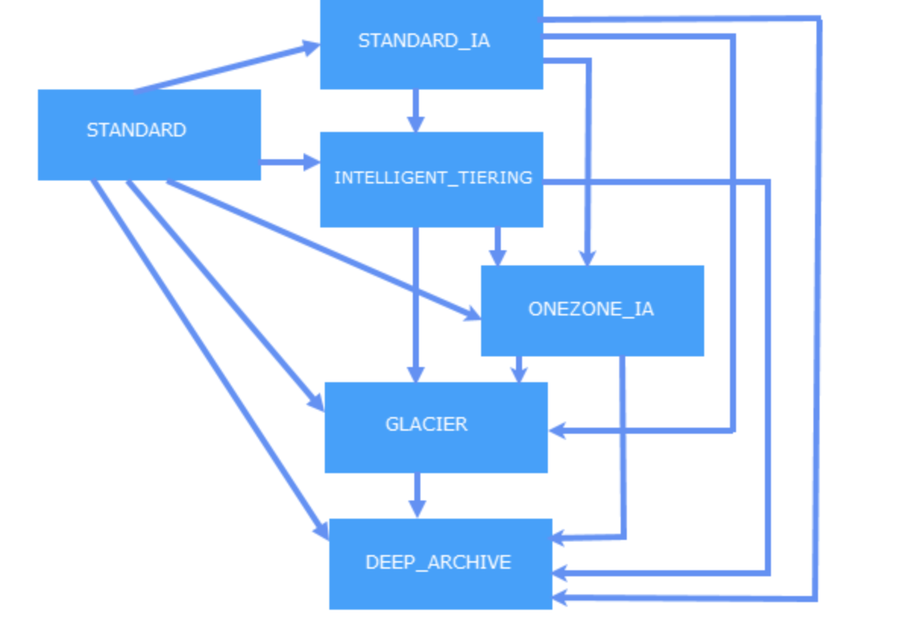

> #### [Amazon Simple Storage Service (S3)](https://docs.aws.amazon.com/AmazonS3/latest/dev/Introduction.html)
Amazon S3 has a simple web services interface that you can use to store and retrieve any amount of data, at any time, from anywhere on the web.

**Bucket :**
- A bucket is a container for objects stored in Amazon S3. Every object is contained in a bucket.
- They organize the Amazon S3 namespace at the highest level, they identify the account responsible for storage and data transfer charges, they play a role in access control, and they serve as the unit of aggregation for usage reporting.
- You can configure buckets so that they are created in a specific region

- Data is stored as objects within resources called “buckets”
- Single object can be up to 5 terabytes in size
- append metadata tags to objects, move and store data across the S3 Storage Classes, configure and enforce data access controls, secure data against unauthorized users, run big data analytics, and monitor data at the object and bucket levels.  
- flat and non-hierarchical structure
- All objects are stored in S3 buckets and can be organized with shared names called prefixes
- can also append up to 10 key-value pairs called S3 object tags to each object
- To keep track of objects and their respective tags, buckets, and prefixes, you can use an S3 Inventory report that lists your stored objects within an S3 bucket or with a specific prefix, and their respective metadata and encryption status
- can create up to 100 buckets in each of your AWS accounts. If you need additional buckets, you can increase your account bucket limit to a maximum of 1,000 buckets by submitting a service limit increase.
- Bucket ownership is not transferable; however, if a bucket is empty, you can delete it
- There is no limit to the number of objects that can be stored in a bucket and no difference in performance whether you use many buckets or just a few
- After you have created a bucket, you can't change its Region
- You cannot create a bucket within another bucket.
- ou can set default encryption on a bucket so that all objects are encrypted when they are stored in the bucket
- The objects are encrypted using server-side encryption with either Amazon S3-managed keys (SSE-S3) or AWS KMS-managed keys (SSE-KMS).
- When you use server-side encryption, Amazon S3 encrypts an object before saving it to disk in its data centers and decrypts it when you download the object
- If objects in the source bucket are not encrypted, the replica objects in the destination bucket are encrypted using the default encryption settings of the destination bucket
- If objects in the source bucket are encrypted using SSE-S3 or SSE-KMS, the replica objects in the destination bucket use the same encryption as the source object encryption. The default encryption settings of the destination bucket are not used.
- You can track default encryption configuration requests through AWS CloudTrail events
- You can host static websites in Amazon S3 by configuring your bucket for website hosting
- Amazon S3 Transfer Acceleration enables fast, easy, and secure transfers of files over long distances between your client and an S3 bucket. Transfer Acceleration takes advantage of Amazon CloudFront’s globally distributed edge locations. As the data arrives at an edge location, data is routed to Amazon S3 over an optimized network path.When using Transfer Acceleration, additional data transfer charges may apply
- Requester Pays Buckets:In general, bucket owners pay for all Amazon S3 storage and data transfer costs associated with their bucket. A bucket owner, however, can configure a bucket to be a Requester Pays bucket. With Requester Pays buckets, the requester instead of the bucket owner pays the cost of the request and the data download from the bucket. The bucket owner always pays the cost of storing data.
- If you enable Requester Pays on a bucket, anonymous access to that bucket is not allowed.
- Cost Allocation S3 Bucket Tags:  A cost allocation tag is a key-value pair that you associate with an S3 bucket. After you activate cost allocation tags, AWS uses the tags to organize your resource costs on your cost allocation report. Cost allocation tags can only be used to label buckets

**Objects :**
- Objects are the fundamental entities stored in Amazon S3. Objects consist of object data and metadata.
- An object is uniquely identified within a bucket by a key (name) and a version ID

An object consists of the following :
- Key
- Version ID
- Value
- Metadata
- Subresources
- Access Control Information

**Keys :**
A key is the unique identifier for an object within a bucket. Every object in a bucket has exactly one key. Because the combination of a bucket, key, and version ID uniquely identify each object, Amazon S3 can be thought of as a basic data map between "bucket + key + version" and the object itself

**Regions :**
You can choose the geographical region where Amazon S3 will store the buckets you create
Objects stored in a region never leave the region unless you explicitly transfer them to another region

**Amazon S3 Data Consistency Model :**

Amazon S3 provides **read-after-write consistency** for PUTS of new objects in your S3 bucket in all regions with one caveat. The caveat is that if you make a HEAD or GET request to the key name (to find if the object exists) before creating the object, Amazon S3 provides eventual consistency for read-after-write.

**eventual consistency** for overwrite PUTS and DELETES in all regions.

While creating a bucket you can configure below subresources
- aws region
- policy and ACL(access control list)
- CORS (cross-origin resource sharing)
- website
- logging
- event notification
- versioning
- lifecycle
- cross-region replication
- tagging
- requestPayment
- transfer acceleration

List Operations
- Object key names are stored lexicographically in Amazon S3 indexes, making it hard to sort and manipulate the contents of LIST
- S3 maintains a single lexicographically sorted list of indexes
- Build and maintain Secondary Index outside of S3 for e.g. DynamoDB or RDS to store, index and query objects metadata rather then performing operations on S3

Multiple Concurrent PUTs/GETs
- S3 scales to support very high request rates. If the request rate grows steadily, S3 automatically partitions the buckets as needed to support higher request rates.
- Introduce some randomness in the key name prefixes, the key names, and the I/O load, will be distributed across multiple index partitions.
- It also ensures scalability regardless of the number of requests sent per second.
- Workloads that include a mix of request types
  - If the request workload are typically a mix of GET, PUT, DELETE, or GET Bucket (list objects), choosing appropriate key names for the objects ensures better performance by providing low-latency access to the S3 index
  - This behavior is driven by how S3 stores key names.
    - S3 maintains an index of object key names in each AWS region.
    - Object keys are stored lexicographically (UTF-8 binary ordering) across multiple partitions in the index i.e. S3 stores key names in alphabetical order.
    - Object keys are stored in across multiple partitions in the index and the key name dictates which partition the key is stored in
    - Using a sequential prefix, such as timestamp or an alphabetical sequence, increases the likelihood that S3 will target a specific partition for a large number of keys, overwhelming the I/O capacity of the partition.
- Workloads that are GET-intensive
  - Cloudfront can be used for performance optimization and can help by
    - distributing content with low latency and high data transfer rate.
    - caching the content and thereby reducing the number of direct requests to S3
    - providing multiple endpoints (Edge locations) for data availability
    - available in two flavors as Web distribution or RTMP distribution

PUTs/GETs for Large Objects
- AWS allows Parallelizing the PUTs/GETs request to improve the upload and download performance as well as the ability to recover in case it fails
- For PUTs, Multipart upload can help improve the uploads by
  - performing multiple uploads at the same time and maximizing network bandwidth utilization
  - quick recovery from failures, as only the part that failed to upload needs to be re-uploaded
  - ability to pause and resume uploads
  - begin an upload before the Object size is known
- For GETs, range http header can help to improve the downloads by
  - allowing the object to be retrieved in parts instead of the whole object
  - quick recovery from failures, as only the part that failed to download needs to be retried.

Networking
- Hosted-style access
  - Amazon S3 routes any virtual hosted–style requests to the US East (N. Virginia) region by default if you use the endpoint s3.amazonaws.com, instead of the region-specific endpoint.
  - Format:
    - http://bucket.s3.amazonaws.com
    - http://bucket.s3-aws-region.amazonaws.com
- Path-style access
  - In a path-style URL, the endpoint you use must match the Region in which the bucket resides.
  - Format:
    - US East (N. Virginia) Region endpoint, http://s3.amazonaws.com/bucket
    - Region-specific endpoint, http://s3-aws-region.amazonaws.com/bucket
- Customize S3 URLs with CNAMEs – the bucket name must be the same as the CNAME.
- Amazon S3 Transfer Acceleration?
  - You might want to use Transfer Acceleration on a bucket for various reasons, including the following:
    - You have customers that upload to a centralized bucket from all over the world.
    - You transfer gigabytes to terabytes of data on a regular basis across continents.
    - You are unable to utilize all of your available bandwidth over the Internet when uploading to Amazon S3.
  - Transfer Acceleration cannot be disabled, and can only be suspended.
  - Transfer Acceleration URL is: bucket.s3-accelerate.amazonaws.com

Pre-Signed URLs

- All buckets and objects are by default private
- Pre-signed URLs allows user to be able to download or upload a specific object without requiring AWS security credentials or permissions
- Pre-signed URL allows anyone access to the object identified in the URL, provided the creator of the URL has permissions to access that object
- Creation of the pre-signed urls requires the creator to provide his security credentials, specify a bucket name, an object key, an HTTP method (GET for download object & PUT of uploading objects), and expiration date and time
- Pre-signed urls are valid only till the expiration date & time

CORS (Cross Origin Resource Sharing)
- All browsers implement the Same-Origin policy, for security reasons, where the web page from an domain can only request resources from the same domain.
- CORS allow client web applications loaded in one domain access to the restricted resources to be requested from another domain
- With CORS support in S3 allows cross-origin access to S3 resources
- CORS configuration rules identify the origins allowed to access the bucket, the operations (HTTP methods) that would be supported for each origin, and other operation-specific information

##### S3 object tags
Use object tagging to categorize storage. Each tag is a key-value pair
You can associate up to 10 tags with an object. Tags associated with an object must have unique tag keys.

##### S3 Versioning
- Use versioning to keep multiple versions of an object in one bucket.
- You must explicitly enable versioning on your bucket.By default, versioning is disabled
- Regardless of whether you have enabled versioning, each object in your bucket has a version ID. If you have not enabled versioning, Amazon S3 sets the value of the version ID to null.
- Enabling and suspending versioning is done at the bucket level
- Versioning protects you from the consequences of unintended overwrites and deletions
- To customize your data retention approach and control storage costs, use object versioning with Object Lifecycle Management
- If you have an object expiration lifecycle policy in your non-versioned bucket and you want to maintain the same permanent delete behavior when you enable versioning, you must add a noncurrent expiration policy. The noncurrent expiration lifecycle policy will manage the deletes of the noncurrent object versions in the version-enabled bucket. (A version-enabled bucket maintains one current and zero or more noncurrent object versions.)

#### Object Lifecycle Management
- To manage your objects so that they are stored cost effectively throughout their lifecycle, configure their lifecycle. A lifecycle configuration is a set of rules that define actions that Amazon S3 applies to a group of objects. There are two types of actions:
  - Transition actions—Define when objects transition to another storage class. For example, you might choose to transition objects to the STANDARD_IA storage class 30 days after you created them, or archive objects to the GLACIER storage class one year after creating them.
  - Expiration actions—Define when objects expire. Amazon S3 deletes expired objects on your behalf.
- Lifecycle configuration on MFA-enabled buckets is not supported.

Supported Transitions and Related Constraints :

#### S3 Cross-Region Replication (CRR)

- Enables automatic, asynchronous copying of objects across buckets in different AWS Regions.
- when to use :
  - Comply with compliance requirements
  - Minimize latency
  - Increase operational efficiency
  - Maintain object copies under different ownership
- Requirements of CRR:
  - Both source and destination buckets must have versioning enabled.
  - The source and destination buckets must be in different AWS Regions.
  - S3 must have permissions to replicate objects from the source bucket to the destination bucket on your behalf.
  - If the owner of the source bucket doesn’t own the object in the bucket, the object owner must grant the bucket owner READ and READ_ACP permissions with the object ACL.
- Only the following are replicated:
  - Objects created after you add a replication configuration.
  - Both unencrypted objects and objects encrypted using Amazon S3 managed keys (SSE-S3) or AWS KMS managed keys (SSE-KMS), although you must explicitly enable the option to replicate objects encrypted using KMS keys. The replicated copy of the object is encrypted using the same type of server-side encryption that was used for the source object.
  - Object metadata.
  - Only objects in the source bucket for which the bucket owner has permissions to read objects and access control lists.
  - Object ACL updates, unless you direct S3 to change the replica ownership when source and destination buckets aren’t owned by the same accounts.
  - Object tags.
- What isn’t replicated
  - Objects that existed before you added the replication configuration to the bucket.
  - Objects created with server-side encryption using customer-provided (SSE-C) encryption keys.
  - Objects created with server-side encryption using AWS KMS–managed encryption (SSE-KMS) keys.
  - Objects in the source bucket that the bucket owner doesn’t have permissions for.
  - Updates to bucket-level subresources.
  - Actions performed by lifecycle configuration.
  - Objects in the source bucket that are replicas created by another cross-region replication. You can replicate objects from a source bucket to only one destination bucket.
- CRR delete operations
  - If you make a DELETE request without specifying an object version ID, S3 adds a delete marker.
  - If you specify an object version ID to delete in a DELETE request, S3 deletes that object version in the source bucket, but it doesn’t replicate the deletion in the destination bucket. This protects data from malicious deletions.

#### Operations on Objects
- Uploading objects—
You can upload objects of up to 5 GB in size in a single operation. For objects greater than 5 GB you must use the multipart upload API.
Using the multipart upload API you can upload objects up to 5 TB each.
- Copying objects—
The copy operation creates a copy of an object that is already stored in Amazon S3.
You can create a copy of your object up to 5 GB in size in a single atomic operation. However, for copying an object greater than 5 GB, you must use the multipart upload API

- You can use a multipart upload for objects from 5 MB to 5 TB in size.
- Delete a single object—Amazon S3 provides the DELETE API that you can use to delete one object in a single HTTP request.
- Delete multiple objects—Amazon S3 also provides the Multi-Object Delete API that you can use to delete up to 1000 objects in a single HTTP request.

#### Managing Access Permissions to Your Amazon S3 Resources

Amazon S3 offers access policy options broadly categorized as resource-based policies and user policies. Access policies you attach to your resources (buckets and objects) are referred to as resource-based policies. For example, bucket policies and access control lists (ACLs) are resource-based policies. You can also attach access policies to users in your account. These are called user policies. You may choose to use resource-based policies, user policies, or some combination of these to manage permissions to your Amazon S3 resources. The introductory topics provide general guidelines for managing permissions.
- Resource-based policies – Bucket policies and access control lists (ACLs) are resource-based because you attach them to your Amazon S3 resources.
  - ACL – Each bucket and object has an ACL associated with it. An ACL is a list of grants identifying grantee and permission granted. You use ACLs to grant basic read/write permissions to other AWS accounts. ACLs use an Amazon S3–specific XML schema.
  - Bucket policy – For your bucket, you can add a bucket policy to grant other AWS accounts or IAM users permissions for the bucket and the objects in it. Any object permissions apply only to the objects that the bucket owner creates. Bucket policies supplement, and in many cases, replace ACL-based access policies.
- User policies – You can use IAM to manage access to your Amazon S3 resources. You can create IAM users, groups, and roles in your account and attach access policies to them granting them access to AWS resources, including Amazon S3.

#### Data protection

- After you enable default encryption for a bucket, the following encryption behavior applies:
  - There is no change to the encryption of the objects that existed in the bucket before default encryption was enabled.
  - When you upload objects after enabling default encryption:
    - If your PUT request headers don't include encryption information, Amazon S3 uses the bucket’s default encryption settings to encrypt the objects.
    - If your PUT request headers include encryption information, Amazon S3 uses the encryption information from the PUT request to encrypt objects before storing them in Amazon S3.
  - If you use the SSE-KMS option for your default encryption configuration, you are subject to the RPS (requests per   second) limits of AWS KMS.
- Using Default Encryption with Cross-Region Replication
  - If objects in the source bucket are not encrypted, the replica objects in the destination bucket are encrypted using the default encryption settings of the destination bucket. This results in the ETag of the source object being different from the ETag of the replica object. You must update applications that use the ETag to accommodate for this difference.
  - If objects in the source bucket are encrypted using SSE-S3 or SSE-KMS, the replica objects in the destination bucket use the same encryption as the source object encryption. The default encryption settings of the destination bucket are not used.
- Use Server-Side Encryption – You request Amazon S3 to encrypt your object before saving it on disks in its data centers and decrypt it when you download the objects.
  -  data encryption at rest
  - Amazon S3 encrypts your data at the object level as it writes it to disks in its data centers and decrypts it for you when you access it
  - You have three mutually exclusive options depending on how you choose to manage the encryption keys:
    - Use Server-Side Encryption with Amazon S3-Managed Keys (SSE-S3) – Each object is encrypted with a unique key. As an additional safeguard, it encrypts the key itself with a master key that it regularly rotates. Amazon S3 server-side encryption uses one of the strongest block ciphers available, 256-bit Advanced Encryption Standard (AES-256), to encrypt your data.
    - Use Server-Side Encryption with AWS KMS-Managed Keys (SSE-KMS) – Similar to SSE-S3, but with some additional benefits along with some additional charges for using this service. There are separate permissions for the use of an envelope key (that is, a key that protects your data's encryption key) that provides added protection against unauthorized access of your objects in S3. SSE-KMS also provides you with an audit trail of when your key was used and by whom. Additionally, you have the option to create and manage encryption keys yourself, or use a default key that is unique to you, the service you're using, and the region you're working in.
    - Use Server-Side Encryption with Customer-Provided Keys (SSE-C)
      - You manage the encryption keys and Amazon S3 manages the encryption, as it writes to disks, and decryption, when you access your objects.
      - you should send the keys and encryption algorithm with each API call
      - recommended to keep rotating the encryption key manually at the client side
      - When using SSE-C ,you must provide encryption key information using the following request headers.
        - x-amz-server-side​-encryption​-customer-algorithm , header to specify the encryption algorithm and its value should be "AES256"
        - x-amz-server-side​-encryption​-customer-key ,header to provide the 256-bit, base64-encoded encryption key
        - x-amz-server-side​-encryption​-customer-key-MD5  header to provide the base64-encoded 128-bit MD5 digest of the encryption key

- It is possible to have different encryption keys for different versions of the same object ( check this point again)
- Use Client-Side Encryption – You can encrypt data client-side and upload the encrypted data to Amazon S3. In this case, you manage the encryption process, the encryption keys, and related tools.

##### Multi-Factor Authentication (MFA) Delete
You can optionally add another layer of security by configuring a bucket to enable MFA (multi-factor authentication) Delete, which requires additional authentication for either of the following operations:
- Change the versioning state of your bucket
- Permanently delete an object version

##### S3 Object Lock
- Amazon S3 Object Lock enables you to store objects using a "Write Once Read Many" (WORM) model. Using S3 Object Lock, you can prevent an object from being deleted or overwritten for a fixed amount of time or indefinitely.
- S3 Object Lock works only in versioned buckets, and retention periods and legal holds apply to individual object versions

- S3 Object Lock provides two ways to manage object retention:
  - retention periods - A retention period specifies a fixed period of time during which an object remains locked. During this period, your object will be WORM-protected and can't be overwritten or deleted
  - legal holds - A legal hold provides the same protection as a retention period, but has no expiration date. Instead, a legal hold remains in place until you explicitly remove it. Legal holds are independent from retention periods: an object version can have both a retention period and a legal hold, one but not the other, or neither.

- You can only enable S3 Object Lock for new buckets. If you need to turn on S3 Object Lock for an existing bucket, please contact AWS Support.
- When you create a bucket with S3 Object Lock enabled, Amazon S3 automatically enables versioning for the bucket.
- Once you create a bucket with S3 Object Lock enabled, you can't disable Object Lock or suspend versioning for the bucket.
- Amazon S3’s support for parallel requests means you can scale your S3 performance by the factor of your compute cluster, without making any customizations to your application. Amazon S3 does not currently support Object Locking. If two PUT requests are simultaneously made to the same key, the request with the latest timestamp wins. If this is an issue, you will need to build an object-locking mechanism into your application.

##### S3 Batch Operations
You can use Amazon S3 batch operations to perform large-scale batch operations on Amazon S3 objects
 - Job - A job is the basic unit of work for Amazon S3 batch operations
 - Operation - An operation is a single command that you want a job to execute.
 - Task - A task is the unit of execution for a job. A task represents a single call to an Amazon S3 or AWS Lambda API operation to perform the job's operation on a single object

##### S3 storage classes (https://aws.amazon.com/s3/storage-classes/)

| Storage Class | Designed for | Durability \(designed for\) | Availability \(designed for\) | Availability Zones | Min storage duration | Min billable object size | Other Considerations  |
| --- | --- | --- | --- | --- | --- | --- | --- |
|  STANDARD  |  Frequently accessed data  |  99\.999999999%   |  99\.99%  |  >= 3  |  None  |  None  |  None  |
|  STANDARD\_IA  |  Long\-lived, infrequently accessed data  |  99\.999999999%   |  99\.9%  |  >= 3  |  30 days  |  128 KB  |  Per GB retrieval fees apply\.   |
|  INTELLIGENT\_TIERING  |  Long\-lived data with changing or unknown access patterns  |  99\.999999999%  |  99\.9%  |  >= 3  |  30 days  |  None  |  Monitoring and automation fees per object apply\. No retrieval fees\.  |
|  ONEZONE\_IA  |  Long\-lived, infrequently accessed, non\-critical data  |  99\.999999999%   |  99\.5%  |  1  |  30 days  |  128 KB  |  Per GB retrieval fees apply\. Not resilient to the loss of the Availability Zone\.  |
|  GLACIER  | Long\-term data archiving with retrieval times ranging from minutes to hours | 99\.999999999%  |  99\.99% \(after you restore objects\)  |  >= 3  |  90 days  |  None  | Per GB retrieval fees apply\. You must first restore archived objects before you can access them\. For more information, see [Restoring Archived Objects](restoring-objects.md)\. |
|  RRS \(Not recommended\)  |  Frequently accessed, non\-critical data  |  99\.99%   |  99\.99%  |  >= 3  |  None  |  None  |  None  |

##### Hosting static website
- Required configurations:
  - Enabling Website Hosting
  - Configuring Index Document Support
  - Permissions Required for Website Access

Two general forms of an Amazon S3 website endpoint are as follows:
- `bucket-name.s3-website-region.amazonaws.com`
- `bucket-name.s3-website.region.amazonaws.com`

##### S3 Notifications
-  S3 notification feature enables you to receive notifications when certain events happen in your bucket.
- Amazon S3 can publish notifications for the following events:
  - A new object created event
  - An object removal event
  - Restore object events
  - A Reduced Redundancy Storage (RRS) object lost event
-  S3 supports the following destinations where it can publish events:
  - Amazon SNS topic
  - Amazon SQS queue
  - AWS Lambda
- Enabling notifications is a bucket-level operation; that is, you store notification configuration information in the notification subresource associated with a bucket

##### Amazon S3 Transfer Acceleration
- Amazon S3 Transfer Acceleration enables fast, easy, and secure transfers of files over long distances between your client and an S3 bucket.
- Transfer Acceleration takes advantage of Amazon CloudFront’s globally distributed edge locations.
- As the data arrives at an edge location, data is routed to Amazon S3 over an optimized network path.

##### Managing Large Amazon SQS Messages Using Amazon S3
- You can use Amazon S3 and the Amazon SQS Extended Client Library for Java to manage Amazon SQS messages.
- This is especially useful for storing and consuming messages up to 2 GB in size
-

##### S3 Faq
https://aws.amazon.com/s3/faqs

##### S3 imp points
- Transfers between S3 buckets or from Amazon S3 to any service(s) within the same AWS Region are free.
